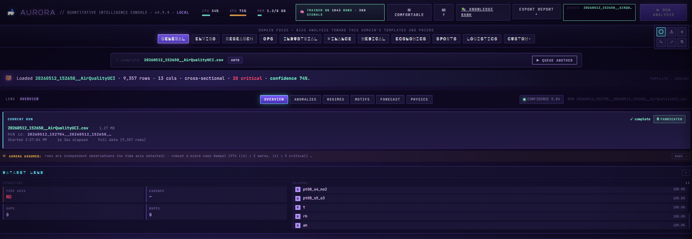
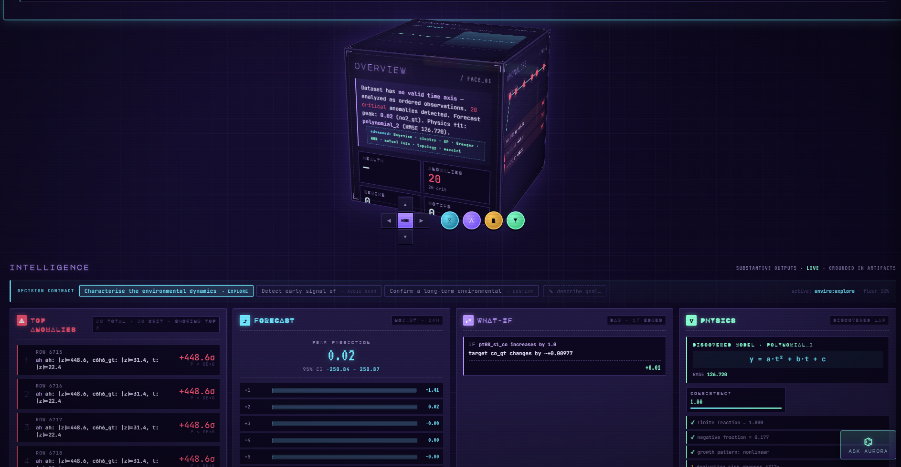
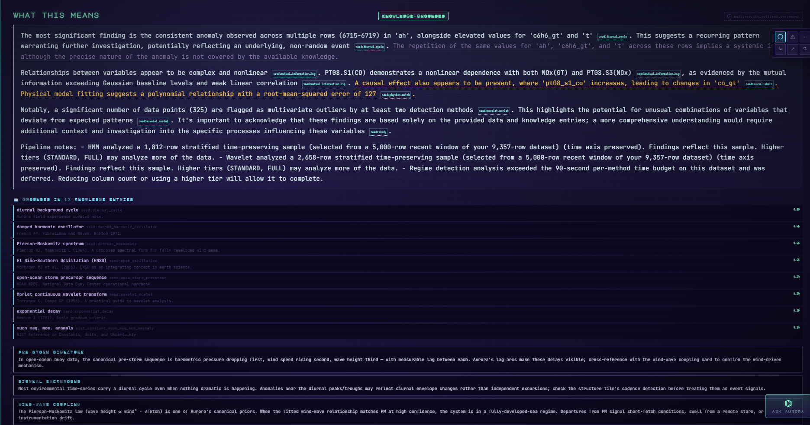
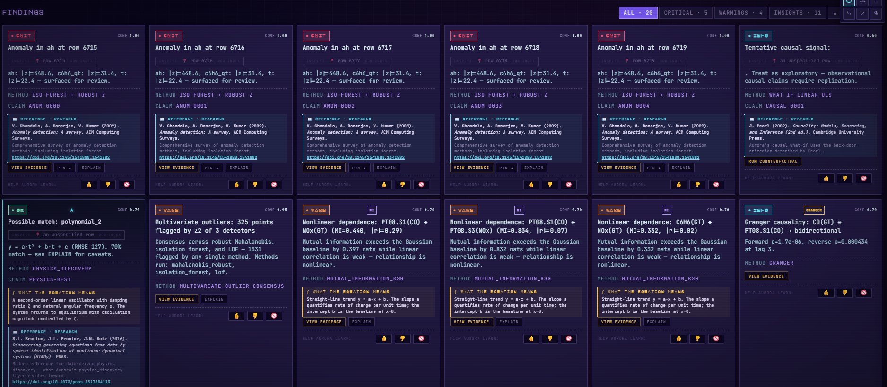
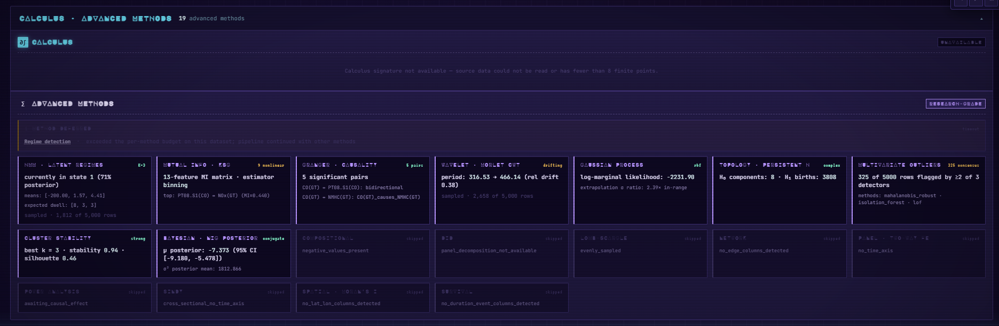
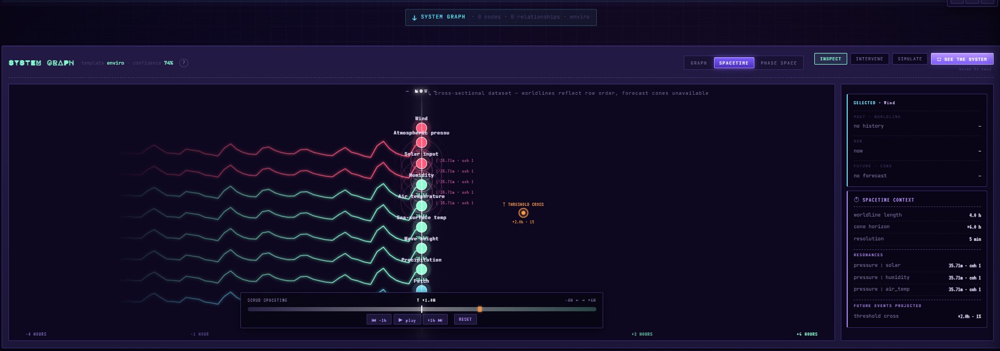
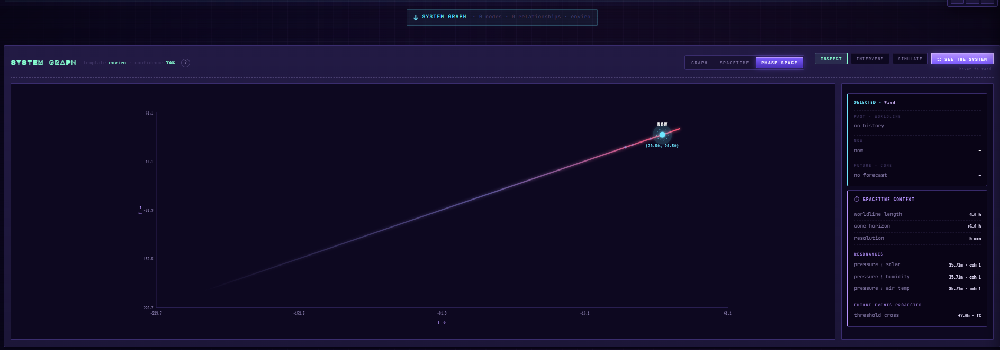

<!-- mcp-name: io.github.FantasyLab-ai/aurora -->
<div align="center">
  

  # Aurora

  ### Glass-box quantitative intelligence. Local. Open. Cited.

  Aurora is the **verification cortex** for serious quantitative work — for humans analyzing hard data, and for AI systems that can't afford to hallucinate.

  > **Cloud LLMs guess. Aurora computes.**

  [](LICENSE)
  [](https://python.org)
  [](#)
  [](#)
  [](https://www.patreon.com/c/FantasyLab3DStudio)

  **[⬇️ Download the desktop app](#%EF%B8%8F-download-the-desktop-app)** · [Run from source](#-quickstart-60-seconds) · [Aurora Sentinel demos](#-aurora-sentinel--decision-contracts-in-the-room) · [See it in action](#see-aurora-in-action) · [Aurora Copilot](#-aurora-copilot--for-humans) · [Aurora Cortex (MCP + SDK)](#%EF%B8%8F-aurora-cortex--for-ai-systems) · [Roadmap](ROADMAP.md) · [FantasyLab.ai](https://fantasylab.ai)
</div>

---

## ⬇️ Download the desktop app

**The easiest way to run Aurora — no Python, no terminal, no setup.** Download
the installer for your OS, double-click, and Aurora opens as a native app with
the analysis backend bundled inside it.

### → [**Download the latest release**](https://github.com/FantasyLab-ai/aurora/releases/latest)

Pick the file that matches your OS (filenames carry the version, e.g. `0.2.0`):

| OS | File to download | Install |
|---|---|---|
| **Windows 10/11** | `Aurora_x.x.x_x64-setup.exe` **(recommended)** | Run the setup wizard. |
| Windows 10/11 | `Aurora_x.x.x_x64_en-US.msi` | Alternative MSI installer (same app). |
| **macOS** (Apple Silicon · M1/M2/M3/M4) | `Aurora_x.x.x_aarch64.dmg` | Open the `.dmg`, drag Aurora to Applications. |
| **Linux** (Debian / Ubuntu / Mint) | `Aurora_x.x.x_amd64.deb` | `sudo apt install ./Aurora_x.x.x_amd64.deb` |
| **Linux** (Fedora / RHEL / openSUSE) | `Aurora-x.x.x-1.x86_64.rpm` | `sudo dnf install ./Aurora-x.x.x-1.x86_64.rpm` |

> `Aurora_aarch64.app.tar.gz` is an auto-updater artifact, **not** a download —
> use the `.dmg` on macOS. There is currently no Intel-Mac (`x86_64`) or Linux
> AppImage build; Intel-Mac users can [run from source](#-quickstart-60-seconds).

On first launch Aurora bootstraps a small knowledge-bank seed, then runs **fully
offline** — no API keys, no cloud, no telemetry. Drop a CSV on the window and
watch it analyze. Aurora is **local-first: your data never leaves your machine**
unless you explicitly share a single finding — see [PRIVACY.md](PRIVACY.md).

> **Heads up on the "Unknown Publisher" warning.** Current releases are not yet
> code-signed, so Windows SmartScreen may show *"Windows protected your PC"* and
> macOS Gatekeeper may say *"unidentified developer."* This is expected for a
> young open-source project. On Windows: **More info → Run anyway**. On macOS:
> **right-click the app → Open**. Code-signing is on the roadmap.

### Desktop app — tips & known quirks

A few things that are **expected behavior**, not bugs:

- **First launch shows a welcome screen, not a run.** That's intentional — a
  fresh start is clean. Drop a CSV (or click a demo card) to begin; your past
  runs are always available under **Data → Bundles**.
- **Give the backend a few seconds on first launch.** Aurora starts a local
  analysis server (`127.0.0.1:8001`) the first time you open it; the status dot
  reads "connecting…" for ~5–10 s before it goes live. If it lingers, the app
  is still warming up — it is not frozen.
- **Big datasets take longer, and results land all at once.** A large file can
  spend a while in *"analyzing…"*. When it finishes you'll see *"analysis
  complete"* and the views populate. If the Overview looks momentarily empty
  right after completion, give it a few seconds or click another tab and back —
  the assembled state is still being fetched, and it will fill in.
- **Re-running the same file is instant.** Identical data + settings reuse a
  cached analysis; the banner reads *"instant · cached."* That's a speed win,
  not a skipped run.
- **Knowledge Bank starts small on a fresh install.** The bundled app ships with
  a seed bank that grows over time; the large multi-thousand-entry bank you may
  see in screenshots is built up on a machine that's been ingesting data for a
  while. Citations still work against whatever is local.

Want to build it yourself or run from source? Keep reading.

---

## ⚡ Quickstart (60 seconds)

```bash
# 1. Clone + create a virtualenv
git clone https://github.com/FantasyLab-ai/aurora.git
cd aurora
python -m venv .venv
# Windows:
.\.venv\Scripts\Activate.ps1
# macOS / Linux:
source .venv/bin/activate

# 2. Install
pip install -r requirements.txt

# 3. Run the Studio
python studio_api.py
```

Open <http://127.0.0.1:8000>. Click **▶ Try a demo** for an instant smoke test, or drop your own CSV / Parquet / JSON / XLSX.

> First run will download a small knowledge-bank seed (~50 MB). After that, Aurora runs **fully offline** — no API keys, no cloud, no telemetry.

**Optional extras** (only if you need them):

```bash
pip install cryptography             # Ed25519 bundle signing
pip install mcp                      # MCP server for LLM agents (Claude Desktop, Cursor, etc.)
pip install -r requirements-dev.txt  # contributor / test extras
```

For the optional Vite + TypeScript frontend build (developers only), see [§ Optional frontend build](#optional-enhanced-frontend-build).

---

## 🖥️ The desktop app

A native, installable app — frameless window, sidebar navigation,
drag-and-drop any file onto it. Built with Tauri 2, with Aurora's **full
analysis backend bundled inside the installer**, so it runs with zero
setup: no Python, no venv, no terminal.

> **Most people should just [download it](#%EF%B8%8F-download-the-desktop-app).**
> The rest of this section is for developers who want to build it from
> source or hack on the UI.

### What it does

| Surface | Behavior |
|---|---|
| Frameless window | Rounded card on transparent OS background; `aurora ◆` titlebar with min/max/close |
| Sidebar (left) | Workspace · Data · Full Studio sections + live "aurora: online / offline" status dot |
| Tab strip (top) | Overview / Findings / Data with one shared sliding underline |
| **Drag & drop ANY file** | CSV, TSV, JSON, JSONL, Parquet, XLSX — drop anywhere on the window, or click to browse |
| Overview | Stat cards (Findings · Methods · Anomalies · Regimes) + **Aurora's narrative** in plain English |
| Findings | Severity-filtered card grid; **click a card for the full evidence panel** |
| Methods | Per-run method tally with share-bars |
| Datasets | Bundled fixtures + demo datasets — **click any card to run it** |
| Bundles | Past runs — every signed `.aurora.json` on disk, status-coded |
| Aurora Studio sidebar | Full legacy UI in an iframe — every feature still reachable |

### Build it from source / develop

The desktop app lives in [`desktop/`](desktop/). To build the installer
yourself (PyInstaller backend + Tauri shell) or run the UI in hot-reload
dev mode, see **[`desktop/README.md`](desktop/README.md)** — it covers the
prerequisites (Node, Rust), the one-command launcher (`launch.ps1`), the
installer build (`build_installer.ps1`), and the Windows Smart App Control
caveat. A `git tag vX.Y.Z` push triggers the cross-platform release CI.

---

## 🚨 Aurora Sentinel — Decision Contracts in the room

Aurora ships a complete **demo rig** under [`demos/`](demos/) that turns a Decision Contract trip into something tangible — a Discord ping, a Slack alert, an OBS overlay card, a smart-plug flipping in your room. Five "I gave my local AI X and watch what it caught" videos, all built on the same scaffolding.

| # | Demo | Hero shot | What it shows |
|---|---|---|---|
| 1 | **Aurora Alarm** | A physical light flips when the data breaks | The closed loop is real — software → cited reason → real-world consequence |
| 2 | **Community Sentinel** | A Discord embed lands with method + row + |z|σ | Drop-in for any Discord community; cited anomalies, no cloud |
| 3 | **The Save** | A Slack ping arrives at the regime shift | The "human watching dashboards would have slept through this" demo |
| 4 | **Verification Cortex** | An agent calls Aurora's MCP and acts on a *verified* number | Sells the agent-builder use case; no more confidently-wrong z-scores |
| 5 | **Rediscover the Law** | Aurora derives `y = ½·a·t²` from a falling-ball video | The flagship hook — a free local AI rediscovers gravity, cited to SINDy |

**Quickstart for the demos** (after the install above):

```bash
# Generate the synthetic datasets one time:
python -m demos.datasets.falling_ball.generate
python -m demos.datasets.server_metrics.generate

# Install the demo contracts into Aurora's contracts dir:
cp demos/contracts/*.json ~/.aurora/decision_contracts/        # macOS / Linux
copy demos\contracts\*.json $env:USERPROFILE\.aurora\decision_contracts\   # Windows

# Configure your webhooks once (copy the template + paste your URLs):
cp demos/.env.demos.example demos/.env.demos                   # macOS / Linux
copy demos\.env.demos.example demos\.env.demos                 # Windows

# Run the relay (it reads .env.demos for Discord/Slack URLs):
python -m demos.relay.app
```

Full step-by-step recording walkthrough with OBS setup, contract installation, and a per-demo runbook lives at **[`demos/README.md`](demos/README.md)**.

---

## See Aurora in action

A real run on an environmental air-quality dataset — captured straight from a Studio session.

<div align="center">
  
  <p><em><strong>The run banner.</strong> Domain selector across the top (Research / Ops / Industrial / Finance / Medical / Economics / Sports / Logistics / Custom+) sets context. The Aurora Pulse line below states the run's status in plain English. The <code>0 fabricated</code> chip is the contractual signal that every finding traces to a method.</em></p>
</div>

<div align="center">
  
  <p><em><strong>The Studio.</strong> The Overview cube rotates through six analytical lenses (Overview, Anomalies, Regimes, Motifs, Forecast, Physics). Below it, the Intelligence row surfaces the top anomalies (20 critical), the forecast peak prediction, a what-if causal answer, and the discovered physics law — <code>y = a·t² + b·t + c</code> at RMSE 126.720 — all live and grounded in artifacts, not LLM guesses.</em></p>
</div>

### The moat: every sentence cites a source

<div align="center">
  
  <p><em><strong>"What This Means" reads like a research paragraph because it is one.</strong> Each claim is tagged with a <code>seed:*</code> citation — <code>seed:diurnal_cycle</code>, <code>seed:mutual_information_kg</code>, <code>seed:causal_chain</code>, <code>seed:physics_match</code>, <code>seed:wavelet_morlet</code>, <code>seed:sindy</code> — that links to the exact knowledge-bank entry backing it. The panel below lists all 12 entries Aurora actually retrieved, each with its real source: Newton (1701), French AP (1971), Pierson &amp; Moskowitz (1964), NIST, NOAA NDBC, Torrence &amp; Compo (1998). <strong>No invented citations. No invented numbers. No invented papers.</strong></em></p>
</div>

<table>
  <tr>
    <td width="50%" align="center" valign="top">
      
      <br/><sub><b>Findings as structured atoms.</b> Each card is a typed object — method, severity (crit / high / med), threshold, evidence, citation — not a paragraph of LLM prose. <code>+448.6σ</code> with <code>p &lt; 0E+0</code> isn't a vibes-level "anomaly"; it's a Hampel z-score on row 6715 you can re-run.</sub>
    </td>
    <td width="50%" align="center" valign="top">
      
      <br/><sub><b>19 advanced methods, honestly disclosed.</b> HMM (3 latent regimes), mutual info (13-feature matrix), Granger (5 causal pairs), Wavelet Morlet CWT, Gaussian process, persistent topology, multivariate outliers (325 of 5000 flagged by ≥2 detectors). Methods that couldn't run are explicitly <code>skipped</code> with the reason — <code>no_time_axis</code>, <code>negative_values_present</code>, <code>cross_sectional_no_time_axis</code>. No silent failure.</sub>
    </td>
  </tr>
  <tr>
    <td width="50%" align="center" valign="top">
      
      <br/><sub><b>Spacetime worldlines.</b> Eight entity worldlines (Wind, Atmospheric pressure, Solar input, Humidity, Air temperature, Sea-surface temp, Wave height, Precipitation) plotted against time. The vertical "NOW" line separates past from the forecast cone. The orange marker is a <strong>predicted threshold cross at +2.0h</strong> — fired by Aurora, not a human.</sub>
    </td>
    <td width="50%" align="center" valign="top">
      
      <br/><sub><b>Phase Space.</b> The system reduced to a 2D state projection. The cyan <strong>NOW</strong> marker is current position; the trail behind it is the trajectory it took to get there. Pressure ↔ solar, pressure ↔ humidity, pressure ↔ air_temp resonances (35.71m, coh 1.0) drive the geometry.</sub>
    </td>
  </tr>
</table>

<sub><em>Captured on a 9,357-row cross-sectional air-quality dataset at AUTO tier. Run took ≈14 seconds local on consumer hardware. <code>0 fabricated</code>. 12 cited knowledge entries. Three methods deferred with reason.</em></sub>

---

## Verifying the install

After `python studio_api.py` starts, you should see something like:

```
[aurora] frontend = /path/to/aurora/frontend
 * Running on http://127.0.0.1:8000
```

Open the URL. The Studio greets you with a "drop a dataset" zone. Use any of:

```bash
data/fixtures/factory_bearing_demo.csv      # ships with the repo — bearing failure
data/fixtures/climate_buoy_demo.csv         # ships with the repo — NOAA-style buoy data
data/fixtures/patient_cohort_demo.csv       # ships with the repo — clinical cohort
```

Drop one, click **AUTO** + **▶ RUN ANALYSIS**. In ~10-20 seconds you'll see:

- The six analytical lenses populate (Overview, Anomalies, Regimes, Motifs, Forecast, Physics)
- The Findings cards list every cited claim
- The `0 fabricated` chip (always — that's Aurora's contract)

If that worked, you're production-ready.

### Optional: enhanced frontend build (v0.10 Phase 2)

**You do NOT need this to run Aurora.** `python studio_api.py` is the only command required. This section is for developers who want type safety + a Vite hot-reload dev loop for future panel work.

The Phase 2 bundle adds a Vite + TypeScript layer with typed API helpers, hardened Server-Sent Events, and a Nanostores-backed state model. It runs **side-by-side** with the existing frontend and is fully non-breaking — the visible Studio looks identical with or without it.

Requirements: Node 18+ and npm.

**Activation is a one-time build:**

```bash
cd frontend
npm install              # installs Vite, TypeScript, @types/node, Nanostores
npm run build            # produces frontend/dist/aurora.js + aurora.css
cd ..
```

That's it. The next time anyone loads the Studio (whether Flask was already running or not), the bundle activates automatically — Flask's static route serves the new files, and `index.html` HEAD-probes for them on load. Open DevTools console after a page reload and you'll see `⚡ Aurora 0.10.0+phase2 loaded` plus `window.Aurora.api / .store / .stream` available for custom panel work.

**To turn it back off**: `rm -rf frontend/dist/` (or delete the folder). The page reverts to pure-legacy mode with no console warnings.

**For active TypeScript development with hot-reload** (two terminals):

```bash
# Terminal 1 — Flask backend on :8000
python studio_api.py

# Terminal 2 — Vite dev server on :5173 with HMR + Flask proxy
cd frontend && npm run dev
```

Open <http://127.0.0.1:5173> (not :8000). Edits to anything under `frontend/src/` hot-reload instantly. Full guide: [docs/frontend-build.md](docs/frontend-build.md).

> **Status:** v1.1 shipped (May 2026). v1.2 substantially shipped (streaming, cloud, Jupyter, contracts actions, runs library, MCP HTTP). v2.0 actively shipping on `main` (causal do-calculus, multi-dataset joins, Plugin SDK, custom KB ingestion, bundle attestation, KB marketplace, Kafka + Postgres CDC connectors, GPU embeddings). 599 tests passing locally; ~625 in CI. Real users running it on real data.

### Run it in Docker (BYO-LLM)

```bash
cp .env.example .env           # pick a provider + paste your key
docker compose up              # → Aurora Studio at http://localhost:8000
```

One command, persistent state on the host (`./aurora-data/`), no cloud
dependency. See [docs/cloud-deploy.md](docs/cloud-deploy.md) for Fly /
Railway / Render / VPS recipes + the new multi-tenant auth model.

---

## One engine. Two surfaces. Same glass-box.

Aurora has two faces sharing one analytical engine. Same code, same principles, two integration shapes — one for humans clicking through findings, one for AI systems calling APIs.

### 🧠 Aurora Copilot — for humans

*For analysts, quants, scientists, engineers.*

A local quantitative copilot for the work that matters too much to trust to a model that hallucinates. Drop in a dataset and get rigorous findings — anomalies surfaced, causal relationships tested, forecasts with confidence bounds, every claim cited to the underlying computation. No cloud LLM guessing. No black-box math.

- **Glass-box studio** — six analytical lenses (Overview, Anomalies, Regimes, Motifs, Forecast, Physics), spacetime system graph, phase-space projection
- **24+ research-grade methods** — Isolation Forest, robust z-score (Hampel), Granger, HMM Baum-Welch, persistent homology, SINDy, Gaussian processes, mutual information, **VAR**, **DTW**, **BOCPD**, **Robust PCA**, **EMD**, **Kalman**, **Spectral entropy**, and more
- **Knowledge-grounded synthesis** — every "What This Means" sentence cites a `seed:*` entry in a public, licensed knowledge bank
- **Preflight data-quality** — schema validation, missingness pattern detection, irregular-sampling check before any analysis runs (the **`data ok / N issues`** chip next to the fabricated counter)
- **Causal inference (do-calculus)** — Pearl-style backdoor identification + adjustment-OLS estimation. The legacy WHAT-IF panel now ships a "do() causal verdict" beneath every simulator output; the v2.0 LAB has a dedicated full-screen Causal tab for explicit treatment/outcome/intervention queries + counterfactuals
- **Streaming / continuous mode** — point Aurora at a directory; findings refresh as new data lands. Per-finding dedupe so the bus only fires on genuinely new findings; opt-in Decision Contracts auto-fire bridge. **Kafka + Postgres CDC connectors** for non-file sources (deps gated, listed in the v2.0 LAB → Connectors tab)
- **Composable findings** — a finished run's fitted physics / regime / baseline becomes a prior for the next run; aligned findings get a **PRIOR** badge
- **Multi-dataset joins** — pair two finished runs to see shared keys, schema compatibility, and inheritance candidates
- **Runs Library** — pin runs across sessions, A/B compare any two runs, share runs as portable `.aurora.json` bundles
- **Custom KB ingestion** — drop a folder of PDFs / TXT / MD; Aurora walks it, extracts text, folds chunks into your workspace KB. Browse-folder UI in the v2.0 LAB
- **KB pack marketplace** — install curated domain KB packs (Climate / Finance / Biomed / Industrial); preview-state packs labelled honestly
- **Bundle attestation** — three-check rollup (integrity + Ed25519 signature + trusted-signer registry) on any `.aurora.json`
- **Honest disclosure** — sampling, timeouts, and skipped methods are surfaced; never silently faked

→ See it in action: [`examples/factory-bearing/`](examples/factory-bearing/)
→ Conceptual overview: [docs/concepts.md](docs/concepts.md)

### 🛡️ Aurora Cortex — for AI systems

*For AI builders, agent developers, AI product teams.*

The verification layer your AI agents and AI products call when they can't afford to hallucinate quantitative claims. Every LLM today invents numbers; **Aurora is the structurally different fix** — it computes and verifies rather than predicts. Connect via MCP, the Python SDK, or Decision Contracts.

Four programmable surfaces, all consuming the same `.aurora.json` bundle format:

```python
import aurora_sdk as aurora

r = aurora.run("data.csv", depth="standard")
r.findings.critical().by_method("iso-forest")
r.forecast.peak(horizon_hours=24)
r.bundle.save("audit.aurora.json")        # SHA-256 integrity + optional Ed25519 signing

# Verify on any machine with Aurora installed
b = aurora.Bundle.load("audit.aurora.json")
b.verify()                                  # raises if tampered
```

| Layer | Audience | What it does |
|---|---|---|
| **Aurora SDK** ([docs](docs/sdk.md)) | Python devs, notebooks, pipelines | `pip install` away from cited, glass-box quantitative reasoning |
| **Aurora Jupyter** ([docs](docs/jupyter.md)) | Notebook users | `aurora.run(df)` with rich HTML reprs, `to_html_report()` exports |
| **Aurora MCP** ([docs](docs/mcp.md)) | LLM agents (Claude Desktop, Claude Code, Cursor, custom) | `uvx aurora-mcp` — 7 tools via stdio or HTTP transport; path-allowlisted, output-capped, JSON-only |
| **Decision Contracts** ([docs](docs/decision-contracts.md)) | Automation pipelines | Programmable predicates → webhook / log / file / **Slack / Discord / email** when findings match. SSRF + recipient-cap guards. Streaming bridge fires contracts on live findings |
| **Aurora Streaming** ([docs](docs/streaming.md)) | Live data feeds | File-watcher + rolling window + SSE event bus; per-finding dedupe; optional contracts auto-fire. **Kafka + Postgres CDC connectors** (deps gated) |
| **Aurora Causal** ([docs](docs/causal-inference.md)) | Analysts asking "what if X?" | Pearl do-calculus: backdoor identification + adjustment OLS + counterfactual queries on the run's system_model DAG |
| **Runs Library** ([docs](docs/runs-library.md)) | Anyone iterating on a dataset | Pin runs across sessions, A/B compare two runs, export portable `.aurora.json` |
| **Plugin SDK** ([docs](docs/plugins.md)) | Domain specialists | Register third-party methods via the `aurora_plugins` entry-point group; same finding contract as built-ins |
| **Custom KB ingestion** | Researchers with private libraries | Drop a folder of PDFs / TXT / MD into your workspace KB |
| **Bundle Attestation** | Anyone consuming a shared `.aurora.json` | Verify integrity + Ed25519 signature + trusted-signer registry in one call |
| **Aurora Cloud** ([docs](docs/cloud-deploy.md)) | Self-hosted deployments | Docker image, BYO-LLM, multi-tenant auth, per-workspace data isolation, usage logging |
| **Research Kit** ([docs](docs/research-kit.md)) | Researchers, academics | `methods.md` + `references.bib` + `replication.json` + `.zenodo.json` for DOI minting |

→ Wire Aurora into Claude Desktop in 5 minutes: [`examples/mcp-claude-desktop/`](examples/mcp-claude-desktop/)
→ Build a "fire when 3+ critical anomalies appear" automation: [`examples/decision-contracts/`](examples/decision-contracts/)

---

## Why Aurora exists

Every AI today — including the best cloud LLMs — hallucinates on quantitative claims. Bigger models don't fix it. RAG alone doesn't fix it. Chain-of-thought just produces longer confident lies.

Aurora is the rarest kind of fix — **structurally different**. It computes and verifies rather than predicts. It runs locally on your machine. It shows its math. Every relationship Aurora reports is computed, not guessed. Every claim cites its source. Every uncertain finding is rendered as uncertain — never confident-looking math over shaky ground.

### Core principles

- 🔍 **Glass-box at every layer.** Every node, edge, finding, and recommendation traces to its source. Bundles carry a SHA-256 content hash and can be Ed25519-signed.
- 💻 **Local-first, always.** Your data stays on your machine. No telemetry. No phone-home. The MCP server enforces a per-call path allowlist; Decision Contracts block private-IP webhook targets by default.
- 🎯 **Honesty rule.** Uncertain relationships render as uncertain. When methods sample or time out, the user is told. Aurora's `fabricated_count` chip is a contractual `0` — and it's audited live.
- 📖 **Open source.** Apache 2.0. Inspectable. Forkable. Yours to audit, vendor, embed, redistribute.

---

## How it connects

Aurora is built to be infrastructure both humans and AI systems can call:

- **MCP Server** — connect any MCP-compatible AI client (Claude Desktop, Claude Code, Cursor, custom agents). 7 tools advertised; path-allowlisted; 2 MB output cap; JSON-only error wrapping
- **Python SDK** — `import aurora_sdk` in notebooks, scripts, pipelines, agent frameworks
- **Decision Contracts** — programmable predicates fire actions (webhook / log / append-only file). SSRF-guarded, rate-limited, audited
- **Webhooks** — deliver verified findings to Slack / Discord / PagerDuty / your own intake API (Slack/Discord/PagerDuty action types coming in v1.2; generic webhook ships now)
- **Local Studio** — full glass-box exploration of findings, intelligence panels, system graph, cube navigator
- **Aurora Bundle Format v1** — a portable, signable, citeable `.aurora.json` artifact that every layer above produces and consumes

---

## Quick examples

### As a Copilot — drop a CSV, read what Aurora found

```bash
python studio_api.py
# Open http://127.0.0.1:8000 → click "Try a demo → factory_bearing_demo"
# 10 seconds later: 11 cited findings, 3 critical, confidence 84%, 0 fabricated.
```

### As a Cortex — give Claude Desktop the ability to cite real math

Add to your `claude_desktop_config.json`:

```json
{
  "mcpServers": {
    "aurora": {
      "command": "uvx",
      "args": ["aurora-mcp", "--allow-root", "/Users/you/data"]
    }
  }
}
```

No install step — `uvx` fetches [`aurora-mcp` from PyPI](https://pypi.org/project/aurora-mcp/) on first run. (Running from a source checkout instead? Use `"command": "/path/to/aurora/.venv/bin/python", "args": ["-m", "aurora_mcp.server", "--allow-root", "/Users/you/data"]`.)

Then ask Claude:

> Run Aurora on `/Users/you/data/factory_bearing.csv` at standard depth, then drill into the most critical anomaly with full evidence.

Claude chains `aurora_analyze → aurora_findings(severity=crit) → aurora_explain(claim_id=…)` and writes you back a response **citing every method** — never inventing a row number or a z-score.

Full walkthrough: [`examples/mcp-claude-desktop/`](examples/mcp-claude-desktop/)

### As a Cortex — wire findings into automation

`~/.aurora/decision_contracts/bearing-watch.json`:

```json
{
  "id": "bearing-watch",
  "trigger": {"field": "findings.crit_count", "op": ">=", "value": 3},
  "actions": [
    {"type": "webhook", "url": "https://hooks.example.com/aurora"},
    {"type": "file", "path": "alerts.jsonl"}
  ],
  "rate_limit": {"max_per_hour": 12}
}
```

```python
from aurora_sdk import Bundle
from fantasyai.aurora.decision_contracts import load_contracts, fire_contract

bundle = Bundle.load("latest.aurora.json").doc
for c in load_contracts():
    fire_contract(c, bundle)               # webhook fires, audit row appended
```

---

## What's working today

The v1.1 substrate — Bundle Format, SDK, MCP, Decision Contracts, Research Kit, six analytical lenses — is **shipped and stable**. The v1.2 sprint is substantially complete; v2.0 work is landing continuously on `main`.

**Analytical methods (17 → 24+):**
- v1.1: Isolation Forest, Hampel z-score, HMM, mutual information, Granger, wavelet, Lomb-Scargle, Gaussian process, persistent topology, SINDy, multivariate outliers, cluster stability, Bayesian, panel, survival, spatial, network, DiD
- v1.2 added: **VAR**, **DTW**, **BOCPD**, **Robust PCA**, **EMD**, **Kalman**, **Spectral entropy** — each with skip reasons + glass-box compliance

**v1.2 surfaces (mostly shipped):**
- **Streaming / continuous mode** — `/api/stream/start|stop|status|events` with SSE event bus, per-finding dedupe, opt-in Decision Contracts bridge, Live Findings strip in the Studio
- **Aurora Cloud** (Phase 1 + 2) — Docker + docker-compose + cloud-deploy guide. Multi-tenant auth + per-workspace data isolation + usage logging behind `AURORA_AUTH_REQUIRED=1`
- **BYO-LLM** — pluggable provider abstraction with 5 backends (Anthropic / OpenAI / Gemini / Ollama / OpenAI-compatible)
- **Decision Contracts: Slack / Discord / Email actions** — extend the v1.1 webhook / log / file types. SSRF + recipient caps + URL token redaction
- **Runs Library UI** — pin / A/B compare (via the joins endpoint) / share-as-bundle, all from a top-toolbar chip
- **MCP HTTP transport** — `/mcp/v1/*` endpoints for remote agents that can't subprocess locally; standalone server mode with optional token gate
- **Preflight data-quality** — schema + missingness + irregular-sampling checks. `data ok / N issues` pill alongside the fabricated chip
- **Jupyter integration** — `aurora.run(df)` with rich HTML reprs, `to_html_report()`, sample notebook
- **KB pack distribution** — manifest + downloader + 4 starter packs + registry auto-detection

**v2.0 surfaces (shipping, exposed in the ⚡ v2.0 LAB modal):**
- **Causal inference (do-calculus)** — `fantasyai/aurora/causal/`. Backdoor identification + adjustment-OLS estimation + counterfactual queries. The legacy WHAT-IF panel now also returns a "do() causal verdict" beneath every simulator output
- **Multi-dataset joins** — `/api/joins/analyze` produces shared keys + schema compatibility + cross-correlation hints + inheritance candidates between two finished runs
- **Composable findings** — extract priors from a finished run, inherit them into the next; aligned findings get a `PRIOR · matches / drifts / novel` badge
- **Plugin SDK** — third-party methods register via `aurora_plugins` entry-point group; same contract as built-ins; failures are isolated
- **Custom KB ingestion** — drop a folder of PDFs / TXT / MD; Aurora walks it and folds chunks into the workspace KB. Folder picker + drag-and-drop in the v2.0 LAB
- **Bundle attestation** — three-check rollup (integrity + Ed25519 signature + trusted-signer registry) on any `.aurora.json`
- **KB pack marketplace** — install curated domain KB packs (Climate / Finance / Biomed / Industrial). Preview-state packs honestly labelled "not yet released"
- **Streaming connectors** — Kafka + Postgres CDC connectors for non-file sources. Deps are gated; the v2.0 LAB → Connectors tab lists install hints
- **GPU embeddings** — `AURORA_EMBEDDINGS_DEVICE=cuda|mps|auto` env-var device selection with graceful CPU fallback

**Counts:**
- **599 tests passing** locally; ~625 in CI (scipy + flask-dependent tests run there)
- 16 backend modules import cleanly
- 0 fabricated findings — contractual

Local execution end-to-end. No cloud dependency after initial knowledge bank download.

## What's rough

Named honestly:

- The knowledge bank ships with a seed set; the full pack is downloaded separately and is still expanding
- The 4 v2.0 marketplace packs (Climate / Finance / Biomed / Industrial) are **reserved in the manifest but not yet hosted** — SHAs are `PENDING_FIRST_BUILD`. The Studio labels them `PREVIEW` and disables install until the next manifest revision
- Some advanced methods skip on datasets that lack required structure (no time axis, no entity column) — these skips are correct glass-box behavior; can be confusing without reading the skip reason
- Per-method timeouts (90 s default) defer some methods on very large datasets; disclosed honestly
- Mobile / tablet responsiveness still pending
- Browser security prevents Aurora from reading absolute folder paths from a `<input type="file">` picker; KB ingest seeds the folder name + asks the user to type the absolute path

Build-in-public log: [CHANGELOG.md](CHANGELOG.md).

---

## Built in the open. By a real person. For real work.

Aurora is fully open source under Apache 2.0. The engine, the schema, the baseline templates, the MCP server, the SDK, the webhook layer — all of it. No black box at any layer, including the codebase itself.

The roadmap is public. The build is documented on YouTube. Domain experts who contribute knowledge bank entries or templates will be able to earn from the upcoming marketplace (v2.0). Aurora gets smarter as the community grows.

- ⭐ [Star on GitHub](https://github.com/FantasyLab-ai/aurora) — visibility
- 💜 [Back on Patreon](https://www.patreon.com/c/FantasyLab3DStudio) — recurring support funds the build
- 📺 [Follow the build on YouTube](https://www.youtube.com/channel/UCUtqOJYK9qBIXmpNaeJRjfQ)
- 🎬 [Daily clips on TikTok](https://www.tiktok.com/@fantasylab.ai)
- 🐦 [Daily progress on X](https://twitter.com/Fantasylab_ai)

---

## Roadmap

See [ROADMAP.md](ROADMAP.md) for the full picture. Recent progress:

- **v1.2 — substantially shipped:** Streaming Phase 1+2 · Aurora Cloud Phase 1+2 (Docker + BYO-LLM + multi-tenant auth) · 7 new analytical methods · Jupyter integration · KB pack distribution · Preflight data-quality · **Slack/Discord/Email contract actions** · **Runs Library UI** · **MCP HTTP transport**
- **v2.0 — actively shipping on `main`:** Causal inference (do-calculus) · Multi-dataset joins · Composable findings · Plugin SDK · **Custom KB ingestion (PDFs → KB)** · **Bundle attestation service** · **KB pack marketplace (preview)** · **Kafka + Postgres CDC streaming connectors** · **GPU embedding device gate**
- **v1.2 tail (still open):** Bundle Format v1.1 (signed delta updates) · conversational copilot polish · KB community contribution flow · domain template packs · DuckDB ingest · mobile/tablet responsiveness pass
- **v2.0+ (6–12 months):** Federated knowledge contribution · marketplace with creator revenue share · Aurora kernels · Aurora-as-CI · Web Component embeds · mobile companion

---

## Project Family

Aurora is part of [FantasyLab.ai](https://fantasylab.ai) — local-first AI tools for serious work. Sister project:

- **[Fantasy Studio](https://github.com/fantasylab/studio)** — AI-directed cinematic 3D rendering using real path-traced light simulation. Same philosophy applied to creative work instead of analytical work.

## Contributing

We welcome contributions. See [CONTRIBUTING.md](CONTRIBUTING.md) for setup, code style, testing requirements, and the development workflow.

Good places to start:
- Issues labeled [`good first issue`](https://github.com/fantasylab/aurora/labels/good%20first%20issue)
- Issues labeled [`help wanted`](https://github.com/fantasylab/aurora/labels/help%20wanted)
- Knowledge bank contributions — adding cited entries for new domains. See [docs/knowledge-bank.md](docs/knowledge-bank.md)
- Aurora MCP integrations — example notebooks, demo agents

## Security

Aurora processes data locally. The SDK and MCP server have no telemetry, no phone-home, no analytics. The verification cortex is the moat — and it's audited. See [SECURITY.md](SECURITY.md) for the full security model and how to report a vulnerability.

## License

Aurora is licensed under [Apache License 2.0](LICENSE). Use it commercially, modify it, redistribute it. Just keep the copyright notice and don't claim we endorse your derivative.

For deployment in customer-managed cloud environments with enterprise support, contact [enterprise@fantasylab.ai](mailto:enterprise@fantasylab.ai).

## Acknowledgments

Aurora stands on the shoulders of decades of statistical and analytical research. Citations are baked into every Aurora output. Foundational methods come from researchers including:

- Vipin Chandola, Arindam Banerjee, Vipin Kumar (anomaly detection)
- Judea Pearl (causal inference)
- Rob Hyndman, George Athanasopoulos (forecasting)
- Steven Brunton, Joshua Proctor, Nathan Kutz (SINDy / sparse identification)
- Frank Hampel (robust statistics, 1974)
- Fei Tony Liu, Kai Ming Ting, Zhi-Hua Zhou (Isolation Forest)
- Carl Edward Rasmussen, Christopher K. I. Williams (Gaussian processes)
- C. W. J. Granger (causality)
- L. E. Baum, T. Petrie, G. Soules, N. Weiss (Baum–Welch HMM)
- Thomas Malthus (exponential dynamics, 1798)
- Reverend Thomas Bayes (Bayesian inference)
- …and the broader open scientific community whose work makes Aurora possible

The Aurora project itself is built as part of FantasyLab.ai.

---

<div align="center">

  **Aurora is part of [FantasyLab.ai](https://fantasylab.ai)** · Glass-box, local-first, source-available AI tools for serious work

</div>
